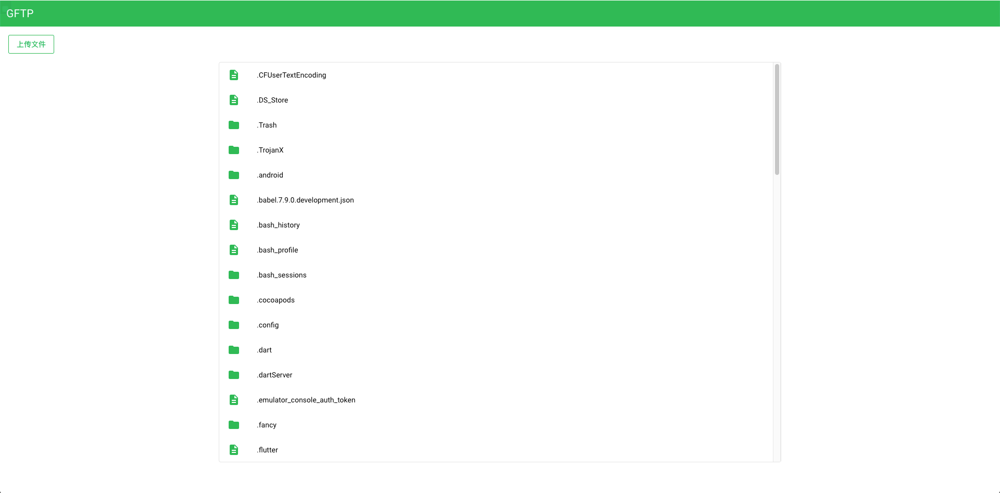
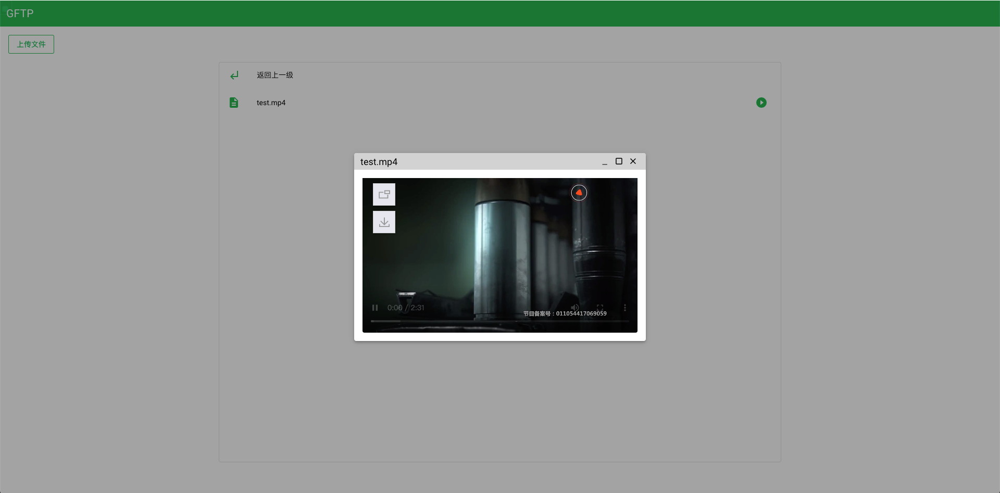
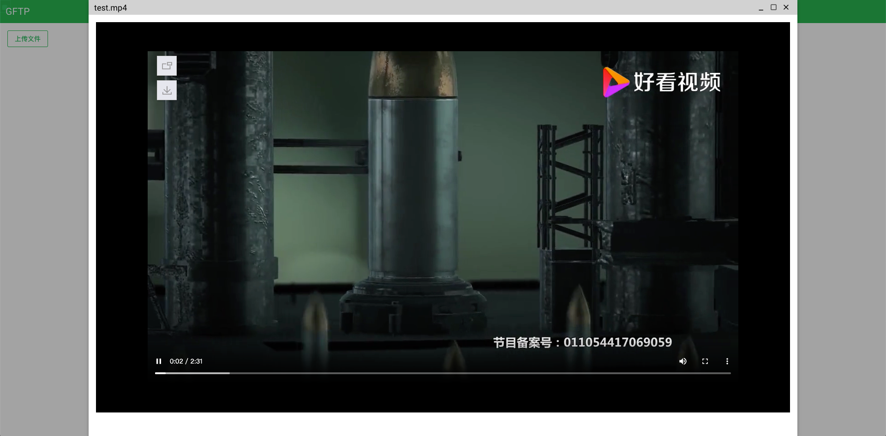
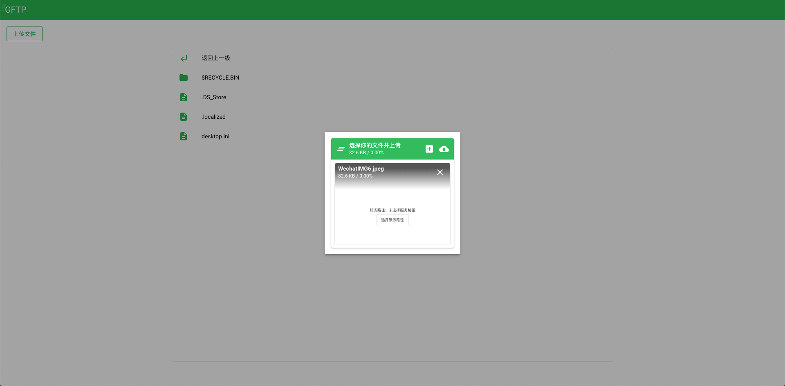
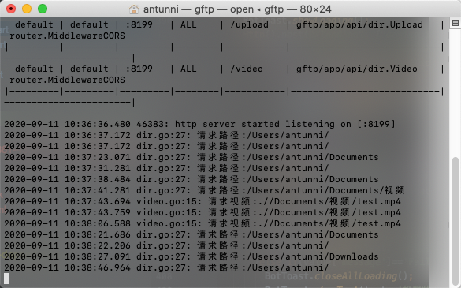

## 项目概览

这是一个基于go的内网文件服务，可直接进行视频播放，文件下载，文件上传等功能。写它的目的源于我想做一个自己的家庭影院，所以开发了它。彼时家里再购置一台树莓派，即可上班时间下电影，下班回家看电影。它并不完善，但对于我的需求已经足够，但不用担心，它十分简单，且我会教你如何二次开发它。

## 预览
















## 如何运行

编译文件处于`bin`目录下，遵从go的特性，linux,mac,windows都编译了可执行文件，双击即可运行

### 自定义路径和端口

正常情况运行它，会将它所在的目录当成服务路径，如果你想自定义路径，可以这样做
```shell
./gftp -path 你的路径 -port 服务端口
```

## 如何开发

如果你会`go`和`vue`，那么这个项目对你就不是难事

### 后端

后端基于`goframe`这个框架，核心代码位于`app/api/dir`下

```shell
├── dir.go # 目录树接口
├── download.go # 下载接口
├── upload.go # 上传接口
└── video.go # 视频接口
```

### 前端

前端代码位于`template/index.html`，它基于`quasar`，一个vue的UI框架和富工具集


**这是前端的初始逻辑图，基于它再去看代码，应该不会有难度**


**这是一个个人项目，如果你想，你可以随意的更改，以便于实现你的需求**